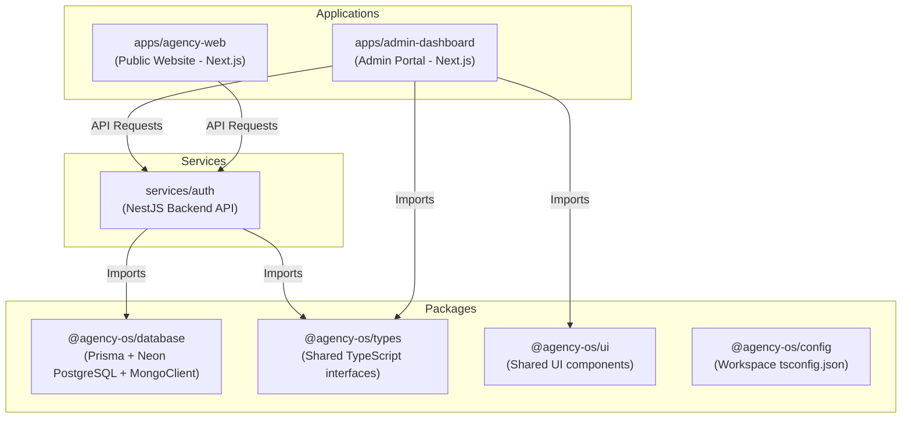
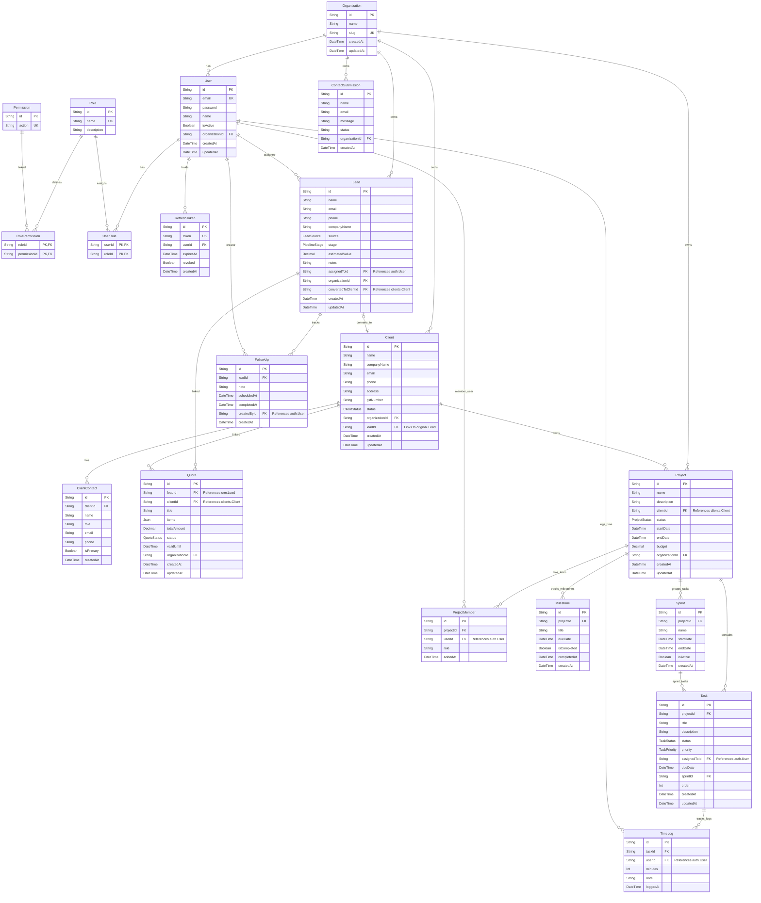

# Trifusion-Dynamics: Architecture Diagrams

This folder contains the complete architecture diagrams for each phase of **Trifusion-Dynamics (AgencyOS)**. These diagrams show the evolution of the database schemas, entity relationships, and module integrations.

---

## 1. Project Structure Overview

This diagram represents how the different apps and services in the monorepo workspace communicate with the database and with each other.

---

## 2. Complete Database Schema (Unified ER Diagram)

This diagram shows how all schemas (`auth`, `cms`, `clients`, `crm`, `projects`) relate to each other. Relations across different schemas are indicated.

---

## 3. Individual Schema Breakdowns

### Schema: `auth`
Manages users, organizations, refresh tokens, roles, and permissions (RBAC).
- `Organization`: The tenant boundary.
- `User`: Accounts associated with organizations.
- `Role` & `Permission`: Controls route and action access (e.g. `admin`, `employee`, `client`).
- `RefreshToken`: Handles long-lived user sessions.

### Schema: `clients`
Manages post-acquisition client companies and their stakeholders.
- `Client`: Client organizations with invoice details.
- `ClientContact`: Specific points of contact within the client organization.

### Schema: `crm`
Tracks sales opportunities and leads progression.
- `Lead`: Prospects from different sources (Website, Upwork, Fiverr, etc.).
- `FollowUp`: Sales call notes and reminders.
- `Quote`: Estimates and pricing drafts sent to leads or clients.

### Schema: `projects`
Tracks development milestones, sprints, tasks, and time tracked.
- `Project`: Core development work blocks.
- `ProjectMember`: Assigns internal employees to client projects.
- `Milestone`: Highlights key project delivery checkpoints.
- `Sprint`: Development cycles (typically 2 weeks).
- `Task`: Individual action items (TODO, IN_PROGRESS, DONE).
- `TimeLog`: Tracks developer work hours on tasks (in minutes).
