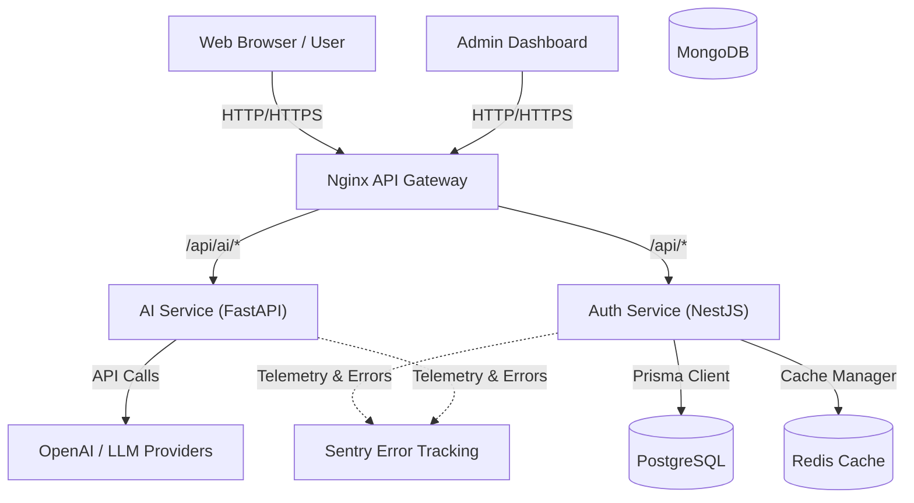

# AgencyOS Ecosystem Architecture

This document describes the overall architecture and how different services connect to each other in the Trifusion-Dynamics / AgencyOS ecosystem.

## Architecture Diagram

## System Components

### 1. Nginx API Gateway
Nginx serves as the reverse proxy for the ecosystem. It listens on port `80` (or `443` for HTTPS) and routes incoming requests:
- Requests starting with `/api/ai/` are routed to the **AI Service**.
- All other `/api/` requests are routed to the **Auth Service**.
- Handles Cross-Origin Resource Sharing (CORS) and serves static assets if needed.

### 2. Auth Service (NestJS)
The primary backend service written in TypeScript using the NestJS framework.
- **Responsibilities**: Handles user authentication, project management, CRM logic, and analytics.
- **Database Access**: Uses Prisma ORM to interact with **PostgreSQL**.
- **Caching**: Uses **Redis** via `nestjs-cache-manager` to improve response times.
- **Observability**: Uses `nestjs-pino` for structured logging and Sentry for error tracking.

### 3. AI Service (FastAPI)
A Python-based service optimized for executing AI workloads and integrating with LLMs.
- **Responsibilities**: Handles AI Proposal Generation, SEO Audits, Email drafting, and Meeting summaries.
- **External Integration**: Calls OpenAI, Anthropic, or Google Generative AI APIs.
- **Observability**: Uses `sentry-sdk` for error capturing.

### 4. Databases & Caching
- **PostgreSQL**: The primary relational database containing schemas for `auth`, `crm`, `billing`, `projects`, etc. It supports pgvector for AI embeddings.
- **Redis**: Used for high-speed caching and rate-limiting.
- **MongoDB**: Left available for specific unstructured data or legacy modules.
